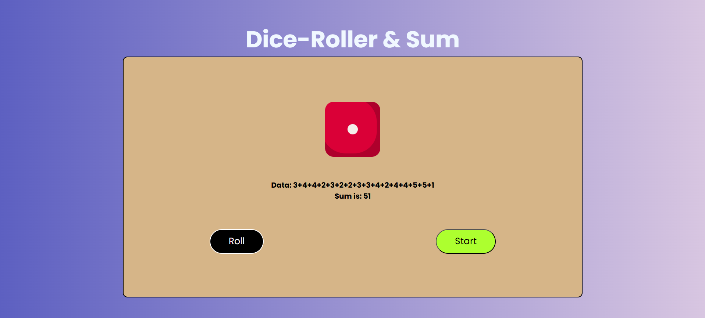

# 🎲 Dice-Roller & Sum

This is a fun and interactive web application that simulates rolling a dice and displays the result along with the running sum. It uses HTML, CSS, and JavaScript to create a responsive and dynamic UI.

Check out the live demo of the project at [Dice-Roller & Sum](https://dicerollersum.netlify.app/).

## 🧩 Features

* Roll a dice and get a random number between 1 and 6.
* Display the rolled value.
* Keep a running sum of all rolled values.
* Simple and responsive design using custom CSS and Google Fonts.

## 🚀 How to Use

1. **Clone the Repository**:

   ```bash
   git clone https://github.com/Pratham070604/dice-roller.git
   cd dice-roller
   ```

2. **Open `index.html` in your browser**:

   * Double-click the file
   * Or right-click and choose "Open with browser"

3. **Click "Roll" to roll the dice.**

4. **Click "Start" to reset or begin the game.**

## 🛠️ Project Structure

```
dice-roller/
├── index.html        # Main HTML structure
├── style.css         # Styling for layout and design
└── index.js          # Logic for rolling the dice and calculating the sum
```

## 🎨 Fonts Used

* [Inter](https://fonts.google.com/specimen/Inter)
* [Poppins](https://fonts.google.com/specimen/Poppins)
* [Roboto Condensed](https://fonts.google.com/specimen/Roboto+Condensed)

## 📦 Dependencies

* No external libraries or frameworks. Just pure HTML, CSS, and JavaScript.

## 📸 Screenshot (Optional)



## 📄 License

This project is open-source and free to use. 
<!-- under the MIT License. -->
